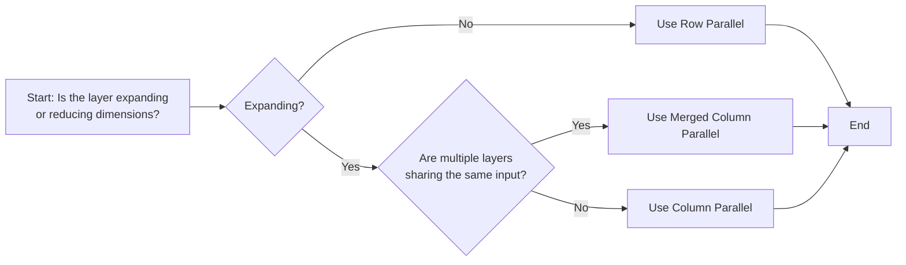

# Utils 

(For analysis)
```python

import inspect
from pprint import pprint
import torch
import numpy as np

def sprint(var):
    frame = inspect.currentframe().f_back
    names = [k for k, v in frame.f_locals.items() if v is var]
    name = names[0] if names else "<unknown>"

    def simple(v):
        return isinstance(v, (int, float, str, bool, type(None)))

    out = {}

    if simple(var):
        out = var
    elif isinstance(var, torch.Tensor):
        out = {
            "type": "torch.Tensor",
            "shape": tuple(var.shape),
            "dtype": var.dtype,
            "device": var.device,
            "requires_grad": var.requires_grad,
        }
    elif isinstance(var, np.ndarray):
        out = {
            "type": "np.ndarray",
            "shape": var.shape,
            "dtype": var.dtype,
        }
    elif hasattr(var, "__dict__"):
        out = {
            k: (
                v if simple(v)
                else {
                    "type": type(v).__name__,
                    **({"shape": tuple(v.shape)} if isinstance(v, torch.Tensor) else {})
                }
            )
            for k, v in vars(var).items()
        }
    else:
        out = {"type": type(var).__name__}

    pprint(f"\n=== {name} ===")
    pprint(out, compact=False)


```

# Llama Model

Command to run:

```bash
python3 -m sglang.bench_one_batch     --model meta-llama/Llama-3.2-1B   --output-len 1 --batch-size 2 --input-len 256     --skip-server-warmup    --log-level ERROR
```

File location:
python/sglang/srt/models/llama.py

## MLP

### Code

```python


class LlamaMLP(nn.Module):
    def __init__(
        self,
        hidden_size: int,
        intermediate_size: int,
        hidden_act: str,
        quant_config: Optional[QuantizationConfig] = None,
        prefix: str = "",
        reduce_results: bool = True,
        layer_id=0
    ) -> None:
        super().__init__()
        sprint(hidden_size)
        sprint(intermediate_size)
        sprintrint(hidden_act)
        sprint(quant_config)
        sprint(prefix)
        self.layer_id = layer_id
        fin_prefix = add_prefix("gate_up_proj", prefix)
        self.gate_up_proj = MergedColumnParallelLinear(
            hidden_size,
            [intermediate_size] * 2,
            bias=False,
            quant_config=quant_config,
            prefix=fin_prefix,
        )
        self.down_proj = RowParallelLinear(
            intermediate_size,
            hidden_size,
            bias=False,
            quant_config=quant_config,
            prefix=add_prefix("down_proj", prefix),
            reduce_results=reduce_results,
        )
        if hidden_act != "silu":
            raise ValueError(
                f"Unsupported activation: {hidden_act}. "
                "Only silu is supported for now."
            )
        self.act_fn = SiluAndMul()

    def forward(
        self,
        x,
        forward_batch=None,
        use_reduce_scatter: bool = False,
    ):
        # pp(forward_batch)
        if self.layer_id == 0:
            pprint("x1")
            sprint(x)
        gate_up, _ = self.gate_up_proj(x)
        
        if self.layer_id == 0:
            pprint("gate_up")
            sprint(gate_up)
        x = self.act_fn(gate_up)
        
        if self.layer_id == 0:
            pprint("x2")
            sprint(x)
        x, _ = self.down_proj(
            x,
            skip_all_reduce=use_reduce_scatter,
        )
        
        if self.layer_id == 0:
            pprint("x3")
            sprint(x)
        return x


```

### Print Result

```bash
Benchmark ...
'x1'
'\n=== x ==='
{'device': device(type='cuda', index=0),
 'dtype': torch.bfloat16,
 'requires_grad': False,
 'shape': (512, 2048),
 'type': 'torch.Tensor'}
'gate_up'
'\n=== gate_up ==='
{'device': device(type='cuda', index=0),
 'dtype': torch.bfloat16,
 'requires_grad': False,
 'shape': (512, 16384),
 'type': 'torch.Tensor'}
'x2'
'\n=== x ==='
{'device': device(type='cuda', index=0),
 'dtype': torch.bfloat16,
 'requires_grad': False,
 'shape': (512, 8192),
 'type': 'torch.Tensor'}
'x3'
'\n=== x ==='
{'device': device(type='cuda', index=0),
 'dtype': torch.bfloat16,
 'requires_grad': False,
 'shape': (512, 2048),
 'type': 'torch.Tensor'}
```


### Explanation

1. `gate_up_proj`
	- This is a `MergedColumnParallelLinear` layer that performs two projections simultaneously
	- Input: (512, 2048) → Output: (512, 16384)
	- It projects the input to a higher dimension (8x expansion)
	- The "merged" aspect means it combines what would typically be two separate linear layers (gate and up projections)
2. `act_fn`
	- Uses the SiLU (Sigmoid Linear Unit) activation function
	- The `SiluAndMul` function likely applies SiLU to one half of the tensor and multiplies it element-wise with the other half
	- This is why the dimension changes from (512, 16384) to (512, 8192) - it's effectively halving the dimension through the multiplication
3. `down_proj`
	- This is a `RowParallelLinear` layer that projects back to the original dimension
	- Input: (512, 8192) → Output: (512, 2048)
	- It reduces the dimension back to the original hidden size


The tensor shapes indicate:
- **Batch size**: 512 (number of tokens being processed in parallel, 256 x 2)
- **Hidden size**: 2048 (dimension of the model's hidden states)
- **Intermediate size**: 16384 (8x the hidden size, expanded dimension)
- After activation: 8192 (half of intermediate size due to SiluAndMul operation)


The code uses parallel processing techniques:
- `MergedColumnParallelLinear` distributes the computation across columns
- `RowParallelLinear` distributes across rows
- The `use_reduce_scatter` parameter suggests it can use efficient communication patterns in distributed settings


Of course! Let's break this down using the fundamentals of matrix multiplication, which is at the heart of neural networks. We'll use your `n` and `m` notation.

#### The Standard Linear Layer (The "Before" Picture)

First, let's establish the baseline. A standard linear layer in PyTorch performs the operation `Y = X @ W + b`.

*   **Input Tensor `X`**: In PyTorch, a batch of data is shaped `(batch_size, num_features)`. So, a **single input vector is a row vector**.
    *   Shape: `(1, n)` where `n` is the number of input features.
*   **Weight Matrix `W`**: This matrix transforms the input.
    *   Shape: `(n, m)` where `m` is the number of output features.
*   **Output Tensor `Y`**: The result of the matrix multiplication.
    *   Shape: `(1, m)`

**The Math:**
`Y = (1 x n) @ (n x m)  →  (1 x m)`

This is the standard, non-parallel operation that happens on a single GPU. The problem is that for very large models, the `W` matrix (`n x m`) can be so enormous that it doesn't fit in one GPU's memory.

---

##### 1. Column Parallel Linear (Splitting the "Recipe")

We use this when the weight matrix `W` is too wide (large `m`) to fit on one GPU. We split the matrix **vertically, by its columns**.

*   **Original Weight Matrix `W`**: Shape `(n, m)`
*   **Let's say we have 2 GPUs (`P=2`)**. We split `W` into two smaller matrices, `W_1` and `W_2`.
    *   `W_1` gets the first half of the columns.
    *   `W_2` gets the second half of the columns.
*   **New Shapes**:
    *   `W_1`: Shape `(n, m/2)`
    *   `W_2`: Shape `(n, m/2)`

**How the Computation Works:**

1.  **Input `X`**: The input `X` (shape `(1, n)`) is **replicated** (copied) and sent to **both** GPU 1 and GPU 2.
2.  **Parallel Calculation**:
    *   On **GPU 1**: `Y_1 = X @ W_1`
        *   `(1 x n) @ (n x m/2)  →  (1 x m/2)`
    *   On **GPU 2**: `Y_2 = X @ W_2`
        *   `(1 x n) @ (n x m/2)  →  (1 x m/2)`
3.  **Combine Results**: The partial results `Y_1` and `Y_2` are then **concatenated** (stitched together horizontally) to form the final output `Y`.
    *   `Y = concatenate([Y_1, Y_2])`
    *   `concatenate([(1 x m/2), (1 x m/2)])  →  (1 x m)`

**Analogy**: Imagine `W` is a recipe book with `n` ingredients (rows) and `m` steps (columns). Column Parallel is like giving the whole ingredient list (`X`) to two chefs. Chef 1 makes the first half of the recipe (`W_1`), and Chef 2 makes the second half (`W_2`). You then combine their finished dishes.

**Communication Step**: This requires an **`all-gather`** operation at the end to concatenate the results from all GPUs.

---

##### 2. Row Parallel Linear (Splitting the "Ingredients")

We use this when the weight matrix `W` is too tall (large `n`) to fit on one GPU. We split the matrix **horizontally, by its rows**.

*   **Original Weight Matrix `W`**: Shape `(n, m)`
*   **Let's say we have 2 GPUs (`P=2`)**. We split `W` into `W_1` and `W_2`.
    *   `W_1` gets the first half of the rows.
    *   `W_2` gets the second half of the rows.
*   **New Shapes**:
    *   `W_1`: Shape `(n/2, m)`
    *   `W_2`: Shape `(n/2, m)`

**Crucial Point**: For the matrix multiplication to work, if `W` is split by rows, the **input `X` must also be split by columns**.

**How the Computation Works:**

1.  **Input `X`**: The input `X` (shape `(1, n)`) is **split** into two pieces.
    *   `X_1`: Shape `(1, n/2)` (sent to GPU 1)
    *   `X_2`: Shape `(1, n/2)` (sent to GPU 2)
2.  **Parallel Calculation**:
    *   On **GPU 1**: `Z_1 = X_1 @ W_1`
        *   `(1 x n/2) @ (n/2 x m)  →  (1 x m)`
    *   On **GPU 2**: `Z_2 = X_2 @ W_2`
        *   `(1 x n/2) @ (n/2 x m)  →  (1 x m)`
3.  **Combine Results**: The partial results `Z_1` and `Z_2` are then **summed together element-wise** to form the final output `Y`.
    *   `Y = Z_1 + Z_2`
    *   `(1 x m) + (1 x m)  →  (1 x m)`

**Analogy**: Imagine `W` is that same recipe book. Row Parallel is like giving Chef 1 the first half of the ingredient list (`X_1`) and the first half of the recipe instructions (`W_1`). Chef 2 gets the second half of the ingredients (`X_2`) and instructions (`W_2`). Their results are not complete on their own, so you must combine their efforts to get the final dish.

**Communication Step**: This requires an **`all-reduce`** operation at the end to sum the results from all GPUs.

---

##### 3. Merged Column Parallel Linear (The LLaMA Optimization)

Look at the Hugging Face `LlamaMLP`:
`down_proj = self.down_proj(self.act_fn(self.gate_proj(x)) * self.up_proj(x))`

Notice that `gate_proj` and `up_proj` are **two separate linear layers** that both take the **exact same input `x`**.

If we used standard Column Parallel for this, we would:
1.  Replicate `x` to all GPUs.
2.  Do a Column Parallel operation for `gate_proj` (requires one `all-gather`).
3.  Do *another* Column Parallel operation for `up_proj` (requires a second `all-gather`).

This is inefficient! **Merged Column Parallel Linear** combines them into one step.

**How it Works:**

1.  **Merge the Weights**: Instead of two separate weight matrices, `W_gate` (`n x m`) and `W_up` (`n x m`), we concatenate them into one giant matrix `W_merged`.
    *   `W_merged = [W_gate, W_up]`
    *   Shape of `W_merged`: `(n, 2m)`
2.  **Apply Column Parallel Splitting**: Now we split `W_merged` by columns, just like in the first example.
    *   `W_1`: Shape `(n, m)` (half of the merged columns)
    *   `W_2`: Shape `(n, m)` (the other half)
3.  **Parallel Calculation**:
    *   Input `X` (shape `(1, n)`) is replicated to both GPUs.
    *   On **GPU 1**: `Y_1 = X @ W_1` → `(1 x m)`
    *   On **GPU 2**: `Y_2 = X @ W_2` → `(1 x m)`
4.  **Combine Results**: One `all-gather` to concatenate `Y_1` and `Y_2`.
    *   `Y_merged = concatenate([Y_1, Y_2])` → `(1, 2m)`
5.  **Split the Output**: The final output `Y_merged` is then split into two parts, which are the results for the original `gate_proj` and `up_proj`.

**Benefit**: We replaced **two** communication steps (`all-gather`) with **just one**. This is a huge performance win.

Choosing between Column Parallel, Row Parallel, and Merged Column Parallel involves understanding your model's architecture, data dimensions, and hardware constraints. Here's a structured guide to help you decide.

---

##### ✅ **Use Column Parallel Linear When:**
- **Expanding dimensions** (e.g., `input_dim → larger_hidden_dim`).
- **Example**: In LLaMA's MLP, `gate_proj` and `up_proj` both expand the input dimension (e.g., 2048 → 16384) 【turn0search18】.
- **Why?** Splitting columns allows each GPU to handle a subset of output features, avoiding memory bottlenecks.

##### ✅ **Use Row Parallel Linear When:**
- **Reducing dimensions** (e.g., `hidden_dim → smaller_output_dim`).
- **Example**: In LLaMA's `down_proj`, the intermediate size (8192) is reduced back to the hidden size (2048) 【turn0search18】.
- **Why?** Splitting rows distributes the workload of handling large input features.

##### ✅ **Use Merged Column Parallel Linear When:**
- **Multiple linear layers share the same input** and can be merged.
- **Example**: LLaMA's `gate_up_proj` merges `gate_proj` and `up_proj` to reduce communication overhead 【turn0search18】.
- **Why?** It reduces the number of all-gather operations from 2 to 1.

---

####  Decision Framework**
Use the following flowchart to guide your choice:



---


## Attention

### Code

```python

class LlamaAttention(nn.Module):
    def __init__(
        self,
        config: LlamaConfig,
        hidden_size: int,
        num_heads: int,
        num_kv_heads: int,
        layer_id: int = 0,
        rope_theta: float = 10000,
        rope_scaling: Optional[Dict[str, Any]] = None,
        rope_is_neox_style: bool = True,
        max_position_embeddings: int = 8192,
        quant_config: Optional[QuantizationConfig] = None,
        prefix: str = "",
        bias: bool = False,
    ) -> None:
        super().__init__()
        self.hidden_size = hidden_size
        tp_size = get_tensor_model_parallel_world_size()
        self.total_num_heads = num_heads
        assert self.total_num_heads % tp_size == 0
        self.num_heads = self.total_num_heads // tp_size
        self.total_num_kv_heads = num_kv_heads
        if self.total_num_kv_heads >= tp_size:
            # Number of KV heads is greater than TP size, so we partition
            # the KV heads across multiple tensor parallel GPUs.
            assert self.total_num_kv_heads % tp_size == 0
        else:
            # Number of KV heads is less than TP size, so we replicate
            # the KV heads across multiple tensor parallel GPUs.
            assert tp_size % self.total_num_kv_heads == 0
        self.num_kv_heads = max(1, self.total_num_kv_heads // tp_size)
        # MistralConfig has an optional head_dim introduced by Mistral-Nemo
        self.head_dim = getattr(
            config, "head_dim", self.hidden_size // self.total_num_heads
        )
        partial_rotary_factor = getattr(config, "partial_rotary_factor", 1)
        self.rotary_dim = int(partial_rotary_factor * self.head_dim)
        self.q_size = self.num_heads * self.head_dim
        self.kv_size = self.num_kv_heads * self.head_dim
        self.scaling = self.head_dim**-0.5
        self.rope_theta = rope_theta
        self.max_position_embeddings = max_position_embeddings

        self.layer_id = layer_id
        
        if self.layer_id == 0:
            sprint(config)
            sprint(hidden_size)
            sprint(num_heads)
            sprint(num_kv_heads)
            sprint(rope_theta)
            sprint(rope_scaling)
            sprint(max_position_embeddings)
            sprint(quant_config)
            sprint(prefix)
            sprint(bias)

        self.qkv_proj = QKVParallelLinear(
            hidden_size,
            self.head_dim,
            self.total_num_heads,
            self.total_num_kv_heads,
            bias=bias,
            quant_config=quant_config,
            prefix=add_prefix("qkv_proj", prefix),
        )
        self.o_proj = RowParallelLinear(
            self.total_num_heads * self.head_dim,
            hidden_size,
            bias=bias,
            quant_config=quant_config,
            prefix=add_prefix("o_proj", prefix),
        )

        self.rotary_emb = get_rope(
            self.head_dim,
            rotary_dim=self.rotary_dim,
            max_position=max_position_embeddings,
            base=rope_theta,
            rope_scaling=rope_scaling,
            is_neox_style=rope_is_neox_style,
        )
        self.attn = RadixAttention(
            self.num_heads,
            self.head_dim,
            self.scaling,
            num_kv_heads=self.num_kv_heads,
            layer_id=layer_id,
            quant_config=quant_config,
            prefix=add_prefix("attn", prefix),
        )

    def forward(
        self,
        positions: torch.Tensor,
        hidden_states: torch.Tensor,
        forward_batch: ForwardBatch,
    ) -> torch.Tensor:
        if self.layer_id == 0:
            pprint("hidden_states1")
            sprint(hidden_states)
        
        qkv, _ = self.qkv_proj(hidden_states)
        
        if self.layer_id == 0:
            pprint("qkv")
            sprint(qkv)
            
        q, k, v = qkv.split([self.q_size, self.kv_size, self.kv_size], dim=-1)
        
        if self.layer_id == 0:
            pprint("q")
            sprint(q)
            pprint("k")
            sprint(k)
            pprint("v")
            sprint(v)
            
        q, k = self.rotary_emb(positions, q, k)
        
        if self.layer_id == 0:
            pprint("q_after_rotary")
            sprint(q)
            pprint("k_after_rotary")
            sprint(k)
            
        attn_output = self.attn(q, k, v, forward_batch)
        
        if self.layer_id == 0:
            pprint("attn_output")
            sprint(attn_output)
            
        output, _ = self.o_proj(attn_output)
        
        if self.layer_id == 0:
            pprint("output")
            sprint(output)
            
        return output
```

### Print
```bash
'hidden_states1'
'\n=== hidden_states ==='
{'device': device(type='cuda', index=0),
 'dtype': torch.bfloat16,
 'requires_grad': False,
 'shape': (512, 2048),
 'type': 'torch.Tensor'}
'qkv'
'\n=== qkv ==='
{'device': device(type='cuda', index=0),
 'dtype': torch.bfloat16,
 'requires_grad': False,
 'shape': (512, 3072),
 'type': 'torch.Tensor'}
'q'
'\n=== q ==='
{'device': device(type='cuda', index=0),
 'dtype': torch.bfloat16,
 'requires_grad': False,
 'shape': (512, 2048),
 'type': 'torch.Tensor'}
'k'
'\n=== k ==='
{'device': device(type='cuda', index=0),
 'dtype': torch.bfloat16,
 'requires_grad': False,
 'shape': (512, 512),
 'type': 'torch.Tensor'}
'v'
'\n=== v ==='
{'device': device(type='cuda', index=0),
 'dtype': torch.bfloat16,
 'requires_grad': False,
 'shape': (512, 512),
 'type': 'torch.Tensor'}
'q_after_rotary'
'\n=== q ==='
{'device': device(type='cuda', index=0),
 'dtype': torch.bfloat16,
 'requires_grad': False,
 'shape': (512, 2048),
 'type': 'torch.Tensor'}
'k_after_rotary'
'\n=== k ==='
{'device': device(type='cuda', index=0),
 'dtype': torch.bfloat16,
 'requires_grad': False,
 'shape': (512, 512),
 'type': 'torch.Tensor'}
'attn_output'
'\n=== attn_output ==='
{'device': device(type='cuda', index=0),
 'dtype': torch.bfloat16,
 'requires_grad': False,
 'shape': (512, 2048),
 'type': 'torch.Tensor'}
'output'
'\n=== output ==='
{'device': device(type='cuda', index=0),
 'dtype': torch.bfloat16,
 'requires_grad': False,
 'shape': (512, 2048),
 'type': 'torch.Tensor'}
```

### Explanation

Below is the **merged version**, rewritten as a **single coherent markdown document**, with **all headings at H4 or lower**.
Content is preserved, flow is unified, and redundancy is removed where the two texts overlapped conceptually.

---

#### Explanation of the LLaMA Attention Mechanism

#### Overview of the Attention Flow

The attention mechanism in LLaMA follows standard multi-head attention, augmented with tensor parallelism, grouped-query attention (GQA), rotary embeddings, and KV caching for efficient distributed inference.

At a high level, attention proceeds in two phases:

1. **Prefill (prompt processing)** — full parallel attention over the entire prompt
2. **Autoregressive decoding** — incremental token-by-token attention using KV cache

The core attention data flow during prefill is:

1. **Input**: Hidden states from previous layer `(512, 2048)`
2. **QKV Projection**: Single merged projection into Query, Key, Value
3. **QKV Split**: Separate Q, K, V tensors
4. **Rotary Embeddings**: Apply positional encoding to Q and K
5. **Attention Computation**: Compute attention scores and weighted values
6. **Output Projection**: Project attention output back to hidden size

---

#### Detailed Component Analysis

##### QKV Projection (`qkv_proj`)

```python
self.qkv_proj = QKVParallelLinear(
    hidden_size,
    self.head_dim,
    self.total_num_heads,
    self.total_num_kv_heads,
    bias=bias,
    quant_config=quant_config,
    prefix=add_prefix("qkv_proj", prefix),
)
```

* **Input**: `(512, 2048)`
* **Output**: `(512, 3072)`
* **Purpose**: Projects hidden states into Q, K, and V in a *single* operation
* **Parallelism**: Column-parallel linear layer

The output dimension `3072` is composed of:

* Query: `32 × 64 = 2048`
* Key: `8 × 64 = 512`
* Value: `8 × 64 = 512`

Total: `2048 + 512 + 512 = 3072`

This reflects **Grouped-Query Attention (GQA)**:

* More query heads than key/value heads
* Each K/V head is shared across multiple Q heads
* Reduces memory and compute while preserving quality

---

##### QKV Splitting

```python
q, k, v = qkv.split([self.q_size, self.kv_size, self.kv_size], dim=-1)
```

* **Input**: `(512, 3072)`
* **Outputs**:

  * `Q`: `(512, 2048)`
  * `K`: `(512, 512)`
  * `V`: `(512, 512)`
* **Purpose**: Separate merged projection for independent processing

---

##### Rotary Embeddings

```python
q, k = self.rotary_emb(positions, q, k)
```

* **Inputs**:

  * `Q`: `(512, 2048)`
  * `K`: `(512, 512)`
* **Outputs**: Same shapes
* **Purpose**: Inject positional information
* **Mechanism**: Rotates pairs of dimensions based on token position

Rotary embeddings preserve dimensionality and are cache-friendly, making them ideal for autoregressive decoding.

---

##### Attention Computation

```python
attn_output = self.attn(q, k, v, forward_batch)
```

* **Inputs**:

  * `Q`: `(512, 2048)`
  * `K`: `(512, 512)`
  * `V`: `(512, 512)`
* **Output**: `(512, 2048)`
* **Implementation**: `RadixAttention`
* **Heads**:

  * 32 Query heads
  * 8 Key/Value heads (GQA)

During prefill, attention computes a full `(512 × 512)` attention matrix. During decoding, this collapses to `(1 × N)` using KV caching.

---

##### Output Projection

```python
output, _ = self.o_proj(attn_output)
```

* **Input**: `(512, 2048)`
* **Output**: `(512, 2048)`
* **Purpose**: Map attention output back to hidden size
* **Parallelism**: Row-parallel linear layer

---

#### Parallel Processing in Attention

LLaMA attention relies on two tensor-parallel linear primitives:

##### Column-Parallel Linear (`QKVParallelLinear`)

* Used for QKV projection
* Splits weight matrix by columns
* Input is replicated across GPUs
* Outputs are concatenated (`all-gather`)

##### Row-Parallel Linear (`o_proj`)

* Used for output projection
* Splits weight matrix by rows
* Input is split across GPUs
* Outputs are summed (`all-reduce`)

---

#### KV Cache and Autoregressive Decoding

A critical optimization is **KV caching**, which avoids recomputing attention for past tokens.

##### Phase 1: Prefill (Prompt Processing)

* Entire prompt (e.g. 512 tokens) is processed in parallel
* Q, K, V are computed for all tokens
* **K and V are stored in the KV cache**
* Attention cost: **O(N²)** (done once)

##### Phase 2: Autoregressive Generation

For each new token:

1. Compute QKV **only for the new token**
2. Append `K_new` and `V_new` to the cache
3. Compute attention:

   ```
   Scores = Q_new @ K_cacheᵀ
   ```
4. Attention matrix shape: `(1, N)`

Per-token cost becomes **O(N)** instead of O(N²).

---

#### Why Attention Is Still Called O(N²)

* The **quadratic cost** comes from `Q @ Kᵀ`
* KV caching reduces **generation-time** cost
* Prefill still requires full `(N × N)` attention

---

#### Tensor Shape Summary

* **Batch size**: 512 tokens
* **Hidden size**: 2048
* **Query heads**: 32
* **Key/Value heads**: 8
* **Head dimension**: 64

GQA structure:

* Q: `32 × 64 = 2048`
* K: `8 × 64 = 512`
* V: `8 × 64 = 512`

---

#### Comparison with Hugging Face Attention

Typical Hugging Face implementation:

```python
q_proj = nn.Linear(hidden_size, num_heads * head_dim)
k_proj = nn.Linear(hidden_size, num_kv_heads * head_dim)
v_proj = nn.Linear(hidden_size, num_kv_heads * head_dim)
o_proj = nn.Linear(num_heads * head_dim, hidden_size)
```

Key differences in the LLaMA-style distributed implementation:

1. **Merged QKV projection**
2. **Tensor parallelism**
3. **RadixAttention**
4. **KV caching optimized for decoding**

This design targets **multi-GPU inference and training**, whereas Hugging Face defaults prioritize simplicity and single-GPU execution.

---

If you want next steps, I can:

* Add **diagrams** for QKV + KV cache
* Rewrite this as **inline code comments**
* Map this directly to **vLLM / Megatron / DeepSpeed** internals


